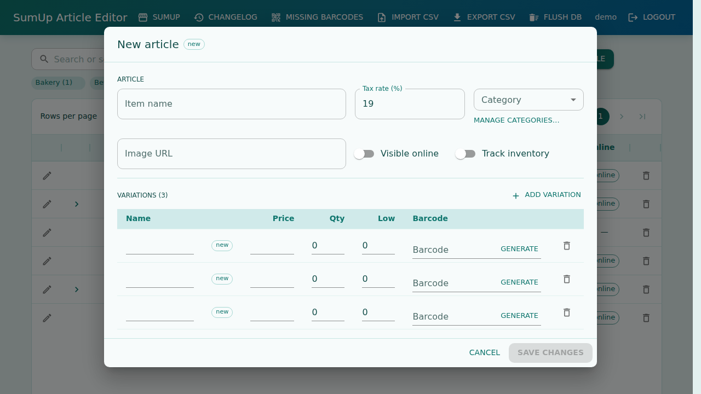

# SumUp Article Editor



[](https://github.com/sebseb7/articleMgmt/actions/workflows/visual-tests.yml)

Import, manage, and re-export SumUp item CSVs. Vite + React + MUI frontend, Express + better-sqlite3 backend.

## Companion app: [ZebraLabel](https://github.com/sebseb7/ZebraLabel)

[ZebraLabel](https://github.com/sebseb7/ZebraLabel) is the Android companion for in-store label printing. Scan a product barcode with the phone camera (Google Barcode API / ML Kit), look up the price from this server’s API, and send a print job to a connected Zebra printer. Pair the app by scanning an API token QR code from **Settings → API tokens** in the web UI. See [docs/api-tokens.md](docs/api-tokens.md) for the HTTP API.

## Ports

| Service         | Port |
|-----------------|------|
| Backend         | 3991 |
| Deploy webhook  | 3992 |
| Frontend        | 4991 |

```bash
npm install
npm run dev      # API on :3991, web on :4991
```

Create users: `npm run user -- create admin your-password`

## Nginx (HTTPS, production)

Build the frontend first: `npm run build`

Run the API on the server (e.g. with systemd): `PORT=3991 AUTH_SECRET=… node server/index.js`

```nginx
# /etc/nginx/sites-available/sumup-articles.conf
server {
    listen 443 ssl http2;
    listen [::]:443 ssl http2;
    server_name articles.example.com;

    ssl_certificate     /etc/letsencrypt/live/articles.example.com/fullchain.pem;
    ssl_certificate_key /etc/letsencrypt/live/articles.example.com/privkey.pem;

    root /var/www/sumup-articles/dist;
    index index.html;

    client_max_body_size 25m;

    location /api/ {
        proxy_pass http://127.0.0.1:3991;
        proxy_http_version 1.1;
        proxy_set_header Host $host;
        proxy_set_header X-Real-IP $remote_addr;
        proxy_set_header X-Forwarded-For $proxy_add_x_forwarded_for;
        proxy_set_header X-Forwarded-Proto $scheme;
    }

    location /deploy/ {
        proxy_pass http://127.0.0.1:3992/;
        proxy_http_version 1.1;
        proxy_set_header Host $host;
        proxy_set_header X-Real-IP $remote_addr;
        proxy_set_header X-Forwarded-For $proxy_add_x_forwarded_for;
        proxy_set_header X-Forwarded-Proto $scheme;
    }

    location / {
        try_files $uri $uri/ /index.html;
    }
}

server {
    listen 80;
    listen [::]:80;
    server_name articles.example.com;
    return 301 https://$host$request_uri;
}
```

Replace `articles.example.com` and `root` with your hostname and deploy path.

### GitHub deploy webhook

Runs beside the API on port 3992. On a signed `push` to `main`/`master` it runs:

`git pull && npm i . && pm2 start sumupbackend && npm run build`

```bash
# .env
GITHUB_WEBHOOK_SECRET=…   # same secret as in the GitHub webhook settings
WEBHOOK_PORT=3992         # optional

npm run webhook
# or: pm2 start server/scripts/deploy-webhook.js --name sumup-webhook
```

In GitHub → **Settings → Webhooks**, add payload URL `https://articles.example.com/deploy/` (content type: `application/json` or `application/x-www-form-urlencoded`, secret: your `GITHUB_WEBHOOK_SECRET`, events: **Just the push event**).

Override the deploy shell with `DEPLOY_COMMAND` if needed.

### Development behind nginx

If you proxy to the Vite dev server instead of `dist/`:

```nginx
location /api/ {
    proxy_pass http://127.0.0.1:3991;
    proxy_set_header Host $host;
    proxy_set_header X-Forwarded-Proto $scheme;
    client_max_body_size 25m;
}

location / {
    proxy_pass http://127.0.0.1:4991;
    proxy_http_version 1.1;
    proxy_set_header Upgrade $http_upgrade;
    proxy_set_header Connection "upgrade";
    proxy_set_header Host $host;
    proxy_set_header X-Forwarded-Proto $scheme;
}
```